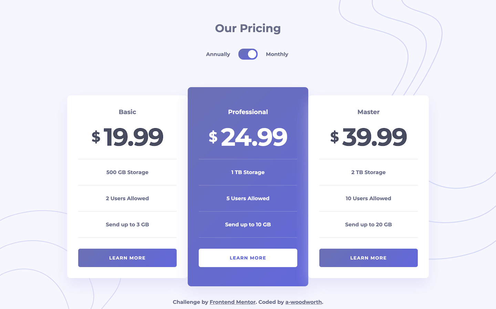
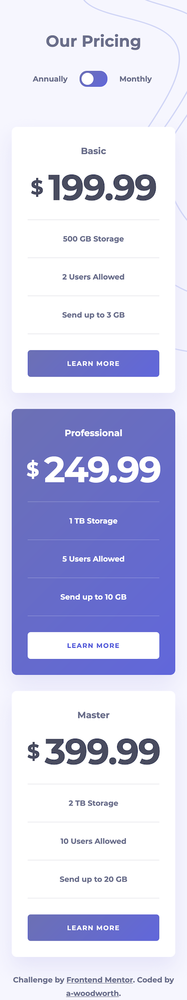

# Frontend Mentor - Pricing component with toggle solution

This is a solution to the [Pricing component with toggle challenge on Frontend Mentor](https://www.frontendmentor.io/challenges/pricing-component-with-toggle-8vPwRMIC).

## Table of contents

- [Overview](#overview)
  - [The challenge](#the-challenge)
  - [Screenshots](#screenshots)
  - [Links](#links)
  - [Built with](#built-with)

## Overview

### The challenge

Users should be able to:

- View the optimal layout for the component depending on their device's screen size
- Control the toggle with both their mouse/trackpad and their keyboard
- **Bonus**: Complete the challenge with just HTML and CSS

### Screenshots

**Desktop**

**Mobile**

### Links

- Solution URL: [Solution](https://www.frontendmentor.io/solutions/pricing-component-with-toggle----html-and-css-variables-8_3mR5uKaN)
- Live Site URL: [Live Site](https://a-woodworth.github.io/pricing_component_toggle)

### Built with

- Semantic HTML5 markup
- CSS Custom properties (variables)
